# VibrationsGame -Front-end 📳🎮
# LaSalle – Master's Final Project 🎓🏭


# Content 📇

* 1.  <a href="#1-main-idea-"> Main Idea </a>
* 2.  <a href="#2-requirements-%EF%B8%8F"> Requirements </a>
* 3.  <a href="#3-folders-and-files-"> Folders and files </a>
* 4.  <a href="#4-configuration-%EF%B8%8F"> Configuration </a>
* 5.  <a href="#5-dependecies-"> Dependecies </a>
* 6.  <a href="#6-how-to-run-test%EF%B8%8F"> How to run test </a>
* 7.  <a href="#6-how-to-build-%EF%B8%8F"> How to build </a>
* 8.  <a href="#7-run-in-local-"> Run in local </a>
* 9.  <a href="#8-how-to-generate-docker-image-"> How to generate docker image </a>
* 10.  <a href="#9-run-in-docker-"> Run in docker </a>
* 11. <a href="#10-game-images-"> Game Images </a>


# 1. Main idea 🤔💭

This is the frontend application for the Vibrations Game. It will send information to the backend side comunicating with Java Spring Boot.

To carry out its functionality, this application uses websockets as a main mean of communication between it and the
backend. It also has some rest endpoints that provide some extra functionality.

# 2. Requirements ✔️

The requirements for this application are:

* Web application.
* Device sensor.
* Fetch data from Restful API.
* Communication via websockets.

# 3. Folders and files 📁

The following shows the folder structure used and the most important files of the project with their corresponding explanations: 

* **.cert** : folder that contains the openssl certificate for https webpages (needed to get Device sensor from client).

* **node_modules** : folder that contains all the external modules that project depends upon (all npm install downloaded).

* **public** : contails all public content of the server to publish, main html, assets and favicon.

* **src**: all source folder. Divided into:
    - **admin**: contain all layouts related with admin page ("/admin").
    - **user**: contain all layouts related with user page, main application ("/").
    - **components**: contain all application minimum elements like: header, footer, titles ...etc. Used by user and admin. Trying to reuse them to the maximum.
    - **assets**: all required files from the application, in this cases only use images with extensions: ".jpg", ".png" and ".json".
    - **index.js**: responsible of injecting all our React application ("App") into our html.   


* **test**: all test cases folder. Divided into:
    - **admin**: contain all tests related with admin page ("/admin").
    - **user**: contain all tests related with user page, main application ("/").
    - **components**: contain all test minimum elements like: header, footer, titles ...etc.
    - **mock**: mock files to mock all canvas styles and files, like image types ".jpg", ".png" and ".json".
      
* **.Dockerfile**: generate the Docker container from the current proyect folders (copying) and installing all dependecies written in the "package-lock.json".

## Technological stack 🧱🔧

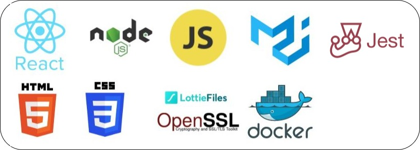

# 4. Configuration ⚙️
The following will explain the configuration parameters defined by the **.env** file located in the main root folder.

### General
```properties
# Indicates the application is using HTTPS protocol.
HTTPS=true
# Indicates which port the frontend application will be using.
PORT=3000
# Indicates the IP/Host address to expose to the world wide web.
Host=192.168.1.53
# Indicates where the .crt certificate is allocated.
SSL_CRT_FILE=.cert/LocalhostRootCA.crt
# Indicates where the .key key is allocated.
SSL_KEY_FILE=.cert/LocalhostRootCA.key

```

# 5. Dependecies 📦
The following list will defined all the package used by the application and why we need them:

### Node_modules
```properties
# Material-UI framework for and easy and faster web development, components and icons with professional styled.
@material-ui/core
@material-ui/icons
@material-ui/lab

# OpenSSL to generate .crt and .key certification files.
openssl

# React - Javascript framework to develop User Interfaces.
react
react-dev-utils
react-dom
react-router-dom
react-scripts

# Lottie is an open source animation file format that's tiny, high quality, interactive, and can be manipulated at runtime. Normaly using ".json" extension.
react-lottie

#Jest is a JavaScript testing framework
jest

```
# 6. How to run test📋✔️

To run the tests you only need to execute the following command in a terminal in the root folder of the project:

```npm test```

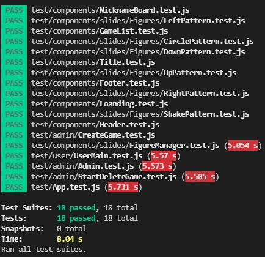

# 7. How to build ⛏️
To build the application you only need to execute the following command in a terminal in the root folder of the project:

```yarn build```

This will generate an deployment release version on "build" folder (root level).

# 8. Run in local 🏠
Go to the root folder where the is the "package.json":

```yarn start``` or ```npm start```

This will start the application with the configuration specified in the .env file. If you want to 
apply a different configuration, change the .env file and reload the application.


# 9. How to generate docker image 🎁
The docker image will be automatically generated when merging to the master branch or creating a tag in GitLab. This is 
configured in the file ```.gitlab-ci.yml``` that can be found in the root folder of this project. The generated docker 
image will be stored in the "Container Registry" from GitLab. The image generated from a merge in the master branch, 
will have the tag "master" attached. Meanwhile, creating a new tag (using a version number) will use said version number  
as the tag, and also update the image with the latest tag.


# 10. Run in docker 🏃
To start the frontend in a docker environment, you need to execute the .Dockerfile present in 
the root folder with the command:  

**Build image🔨:**  
```docker build -t frontend-react:latest . ```  

**Run image🏃:**  
```docker run -d -p 3000:3000 frontend-react:latest  ```

This will start the frontend container applications in the next URL:

```https://{env.IP}:{env.PORT} ``` - User page

```https://{env.IP}:{env.PORT}/admin ```  - Admin page

# 11.  Game images 📸

## User game:

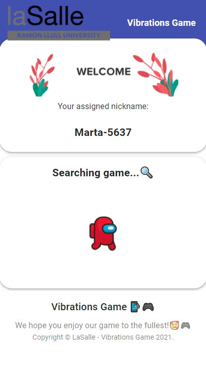
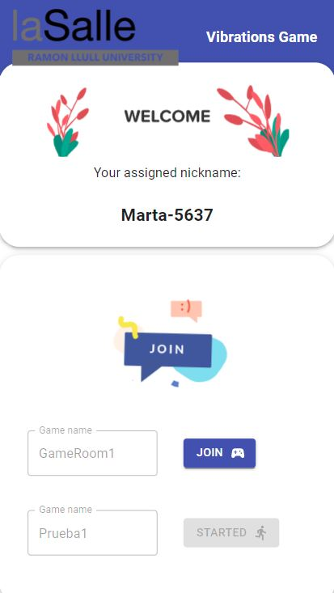
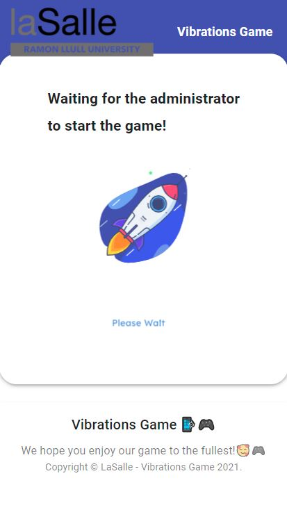
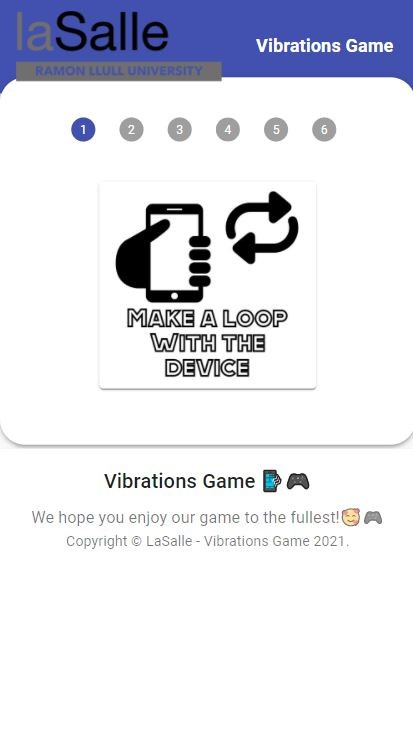
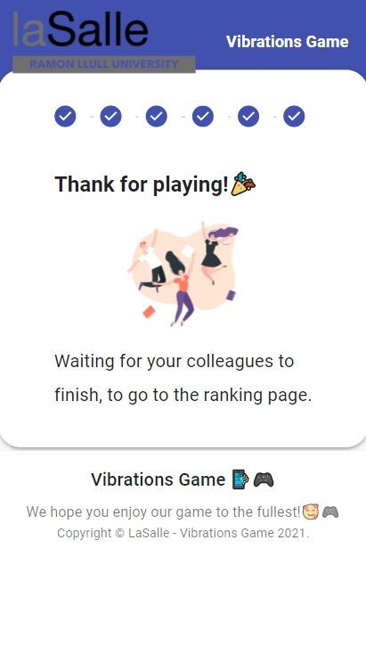
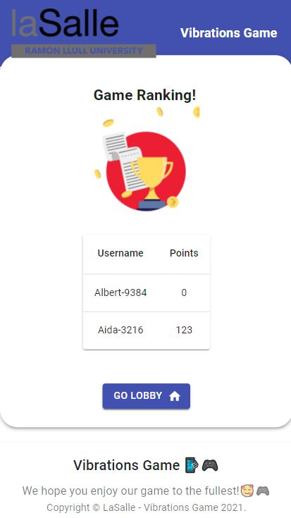

## Admin page:

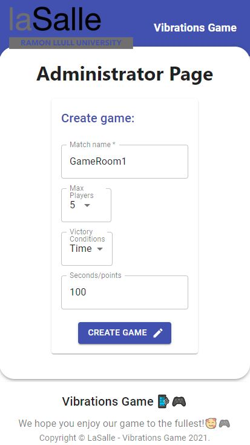
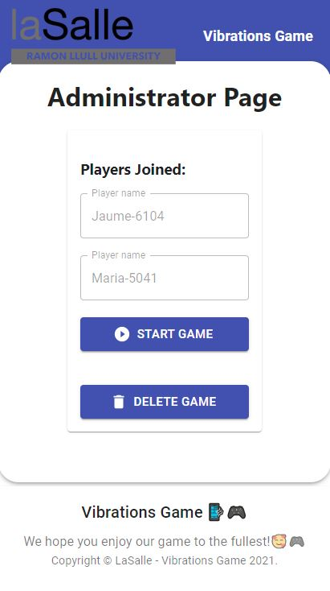
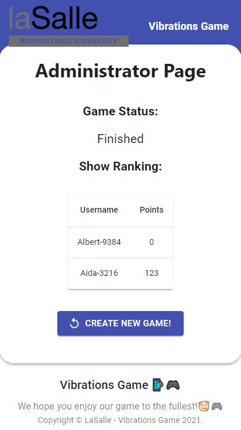
